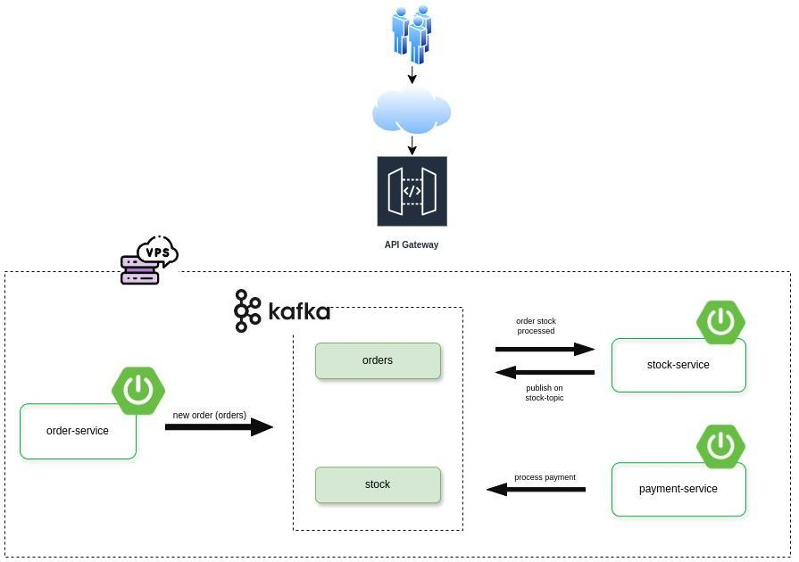

<div align="center">

# POC - Microservices with Kafka and Spring Boot


</div> 

## Description

This architecture consists of three microservices:

`order-service`: Generates an order and publishes a message to the "orders" topic in Kafka. \
`stock-service`: Listens to the "orders" topic, checks the availability of the products specified in the Order, and publishes the result to "stock" topic. \
`payment-service`: Listens to the "stock" topic and simulates the approval of the order. \

Take a look at out architecture diagram:



## Workflow
The `order-service` creates a new `Order` with `OrderStatus.PENDING` and publishes it to the "orders" Kafka topic. \
The `stock-service` consumes the `Order` message, deserializes it, checks product availability, and, if the products are available, publishes the result to the "stock" Kafka topic. \
The `payment-service` consumes the message from the "stock" topic, simulates the payment process, and updates the `OrderStatus` to `PAID`.
## How to use
Access the endpoint by entering the number of orders you want to generate.

###### PORTS
`orders-service`: 8087 \
`stock-service`: 8088 \
`payment-service`: 8089

`orders-service` needs to be running
```
{host}/orders/generate?quantity=10000
```
this way you generate thousands of different orders.

# Running locally with Docker

Go to the root directory and run in terminal:
```
$ docker compose up -d
```
Wait for docker download all images \
Then go to the root directory of each microservice on separate terminals and run: 
```
$ mvn clean spring-boot:run
```

And that's it! you've started Zookeeper, Kafka, MongoDB, and KafkaUI. \
To access Kafka UI, use port 8080.
